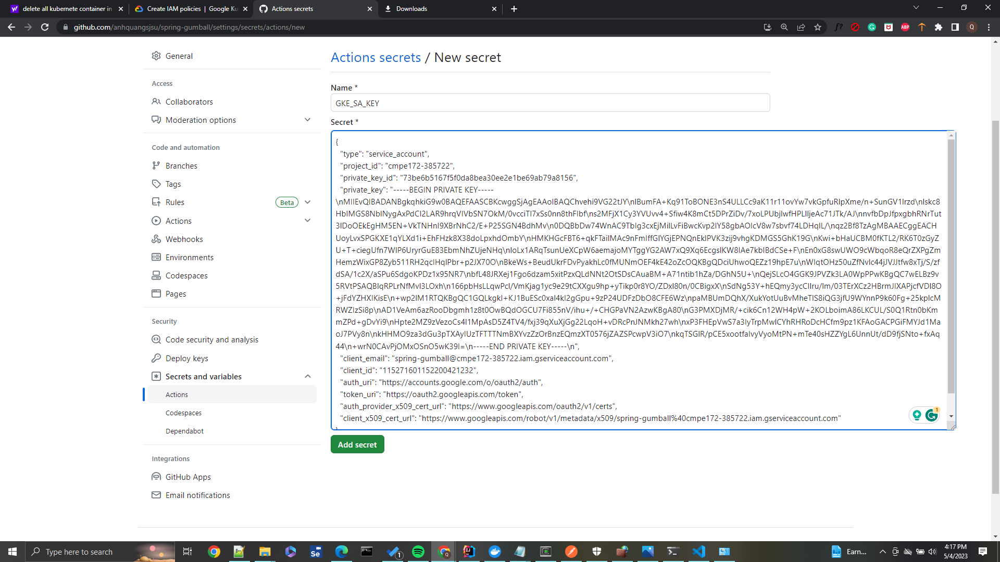

# spring-gumball ci/cd example

### This example demonstrates the following two GitHub Workflows.

* https://help.github.com/actions/language-and-framework-guides/building-and-testing-java-with-gradle

* https://github.com/google-github-actions/setup-gcloud/tree/master/example-workflows/gke

### Build Dependencies

* Gradle 5.6
* JDK 11

### Lab notes

#### Build triggered and completed after adding graddle.yml in .github/workflow

#### cluster created on kubernete

#### Enable Container and Kubnete engine API

#### The API enabled

#### Google Cloud Dashboard

#### Enabling IAM API

#### Creaating service account

#### Granting the acesss for kubernete developer and storage admin

#### Policy updated

#### Creating JSON key and downloaded the key

#### Setting secret for the repo

#### GKE_SA_KEY generated

#### Secret for the git hub repo were generated

#### build 2.4 ( after 2.3) Had to do this since I placed some .yml file in wrong folder so I moved them out!!
%20Had%20to%20do%20this%20since%20I%20placed%20some%20.yml%20file%20in%20wrong%20folder%20so%20I%20moved%20them%20out.PNG)

#### Released 2.4 build

#### Spring gumbal service deployed to kubernete

#### Creating ingress

#### Created ingress

#### Ingress shown in service and ingress tab

#### Gumball on GKE
